<div align="center">

# Modelos No Supervisados
## Segmentación de Perfiles Operacionales de Maquinaria Industrial
### AI4I 2020 Predictive Maintenance Dataset


**Institución:** UEES — Universidad de Especialidades Espíritu Santo  
**Materia:** Aprendizaje Automático — Maestría en Inteligencia Artificial

</div>

---

## Integrantes

| Nombre | Rol |
|--------|-----|
| Madheline Katerine Torres Hallo | Miembro del equipo |
| Carlos Vladimir Ramírez Espinoza | Miembro del equipo |
| Dennys Francisco Salazar Domínguez | Miembro del equipo |

---

## Tabla de Contenidos

1. [Descripción del Proyecto](#descripción-del-proyecto)
2. [Dataset](#dataset)
3. [Estructura del Repositorio](#estructura-del-repositorio)
4. [Entorno de Trabajo](#entorno-de-trabajo)
5. [Análisis Exploratorio](#1-análisis-exploratorio-eda)
6. [Preprocesamiento](#2-preprocesamiento)
7. [K-Means](#3-implementación-de-k-means)
8. [DBSCAN](#4-implementación-de-dbscan)
9. [PCA](#5-reducción-de-dimensionalidad-pca)
10. [t-SNE](#6-visualización-con-t-sne)
11. [Comparación de Modelos](#7-comparación-de-modelos)
12. [Perfiles de Clusters](#8-perfiles-de-clusters)
13. [Detección de Anomalías](#9-detección-de-anomalías)
14. [Pipeline Completo](#10-pipeline-completo)
15. [Análisis Crítico y Conclusiones](#análisis-crítico-y-conclusiones)
16. [Referencias](#referencias)

---

## Descripción del Proyecto

Una plataforma IoT de monitoreo industrial necesita segmentar los perfiles de operación de sus activos para:

- Optimizar estrategias de **mantenimiento predictivo** diferenciadas por régimen operacional
- Reducir **tiempos no planificados de parada** mediante alertas tempranas por perfil
- Adaptar **umbrales de tolerancia** según el tipo de operación identificada

Se implementan y comparan cuatro técnicas de aprendizaje no supervisado: **K-Means**, **DBSCAN**, **PCA** y **t-SNE**, sobre el dataset AI4I 2020 Predictive Maintenance de 10 000 registros de sensores industriales reales.

---

## Dataset

| Atributo | Detalle |
|---|---|
| **Nombre** | AI4I 2020 Predictive Maintenance Dataset |
| **Fuente** | UCI Machine Learning Repository |
| **Registros** | 10 000 |
| **Variables de sensores** | 5 (temperatura, velocidad, torque, desgaste) |

### Variables

| Variable | Tipo | Descripción | Uso |
|---|---|---|---|
| `UDI` | Entero | Identificador único | Excluido |
| `Type` | Categórica | Tipo de máquina: L / M / H | Referencia |
| `Air temperature [K]` | Continua | Temperatura del aire | Incluida |
| `Process temperature [K]` | Continua | Temperatura del proceso | Incluida |
| `Rotational speed [rpm]` | Continua | Velocidad rotacional | Incluida |
| `Torque [Nm]` | Continua | Torque | Incluida |
| `Tool wear [min]` | Continua | Desgaste de herramienta | Incluida |
| `Machine failure` | Binaria | Fallo (0/1) | Validación |

> **Distribución:** 9 664 registros sin fallo (96.6%) — 336 con fallo (3.4%)  
> **Por tipo:** L = 6 108 (61.1%) — M = 2 931 (29.3%) — H = 961 (9.6%)

---

## Estructura del Repositorio

```
TrabajoGrupal-S3/
│
├── assets/                          ← Visualizaciones exportadas (300 DPI)
│   ├── 01_distribucion_variables.png
│   ├── 02_boxplots_tipo_maquina.png
│   ├── 03_matriz_correlacion.png
│   ├── 04_pairplot.png
│   ├── 05_seleccion_k.png
│   ├── 06_kmeans_silhouette.png
│   ├── 07_kmeans_clusters.png
│   ├── 08_kdistance_graph.png
│   ├── 09_dbscan_clusters.png
│   ├── 10_pca_visualizacion.png
│   ├── 11_tsne_visualizacion.png
│   ├── 12_comparacion_kmeans_dbscan.png
│   ├── 13_heatmap_perfiles.png
│   ├── 14_deteccion_anomalias.png
│   └── 15_pipeline_completo.png
│
├── data/
│   └── ai4i_predictive_maintenance.csv   ← Dataset fuente
│
├── notebooks/
│   └── S3_ModelosNoSupervisados_AI4I.ipynb   ← Notebook principal
│
└── README.md
```

> **Nota:** El notebook detecta automáticamente la raíz del repositorio sin importar desde dónde se ejecute (VS Code, Jupyter Lab, terminal). Las carpetas `assets/` y `data/` se resuelven siempre de forma correcta.

---

## Entorno de Trabajo

| Herramienta | Versión |
|---|---|
| Python | 3.10+ |
| pandas | 2.x |
| numpy | 1.x |
| scikit-learn | 1.3+ |
| matplotlib | 3.x |
| seaborn | 0.13.x |
| Jupyter / VS Code | cualquier versión reciente |

```bash
pip install pandas numpy scikit-learn matplotlib seaborn jupyter
```

---

## 1. Análisis Exploratorio (EDA)

### 1.1 Distribución de variables

Se analiza la distribución de las cinco señales de sensores. La temperatura del aire (~300 K) y la de proceso presentan distribuciones aproximadamente normales. La velocidad rotacional y el torque muestran asimetría, indicando distintos regímenes de operación. El desgaste de herramienta se distribuye de forma uniforme entre 0 y 253 minutos.

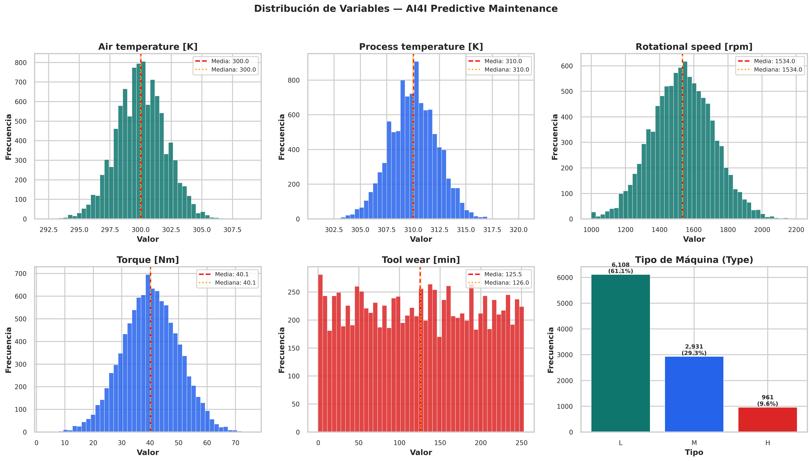

---

### 1.2 Boxplots por tipo de máquina

Comparación de las variables operacionales entre los tres tipos de máquina (L, M, H). Las medianas de velocidad y torque son similares entre tipos, mientras que el desgaste de herramienta muestra mayor variabilidad en el tipo H, coherente con regímenes de trabajo más intensivos.

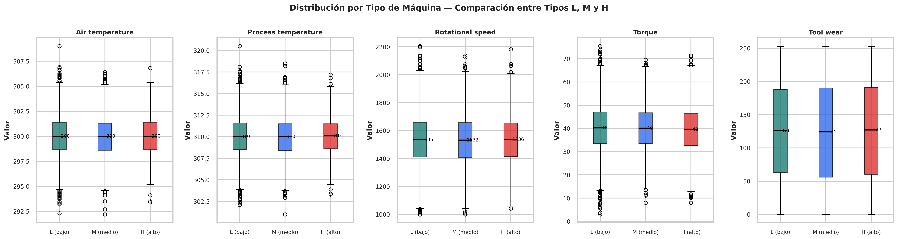

---

### 1.3 Matriz de correlación

La correlación entre variables revela dos relaciones dominantes del sistema:

- **Torque ↔ Velocidad rotacional: −0.88** — relación inversa mecánica (mayor velocidad → menor torque disponible)
- **Temperatura aire ↔ Temperatura proceso: +0.88** — interdependencia térmica del sistema
- **Tool wear ↔ Machine failure: +0.17** — el desgaste acumulado es el predictor individual más relevante de fallo

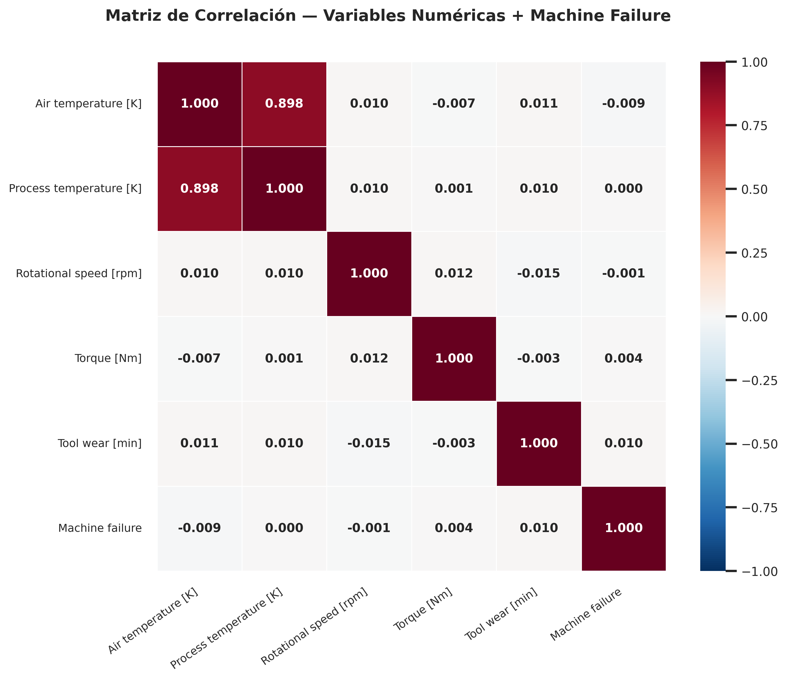

---

### 1.4 Pairplot entre variables clave

Visualización de relaciones bivariadas sobre una muestra de 800 registros, coloreada por estado de fallo. Los registros con fallo tienden a concentrarse en zonas de torque extremo y alta velocidad, indicando que el estrés mecánico es precursor de fallo.

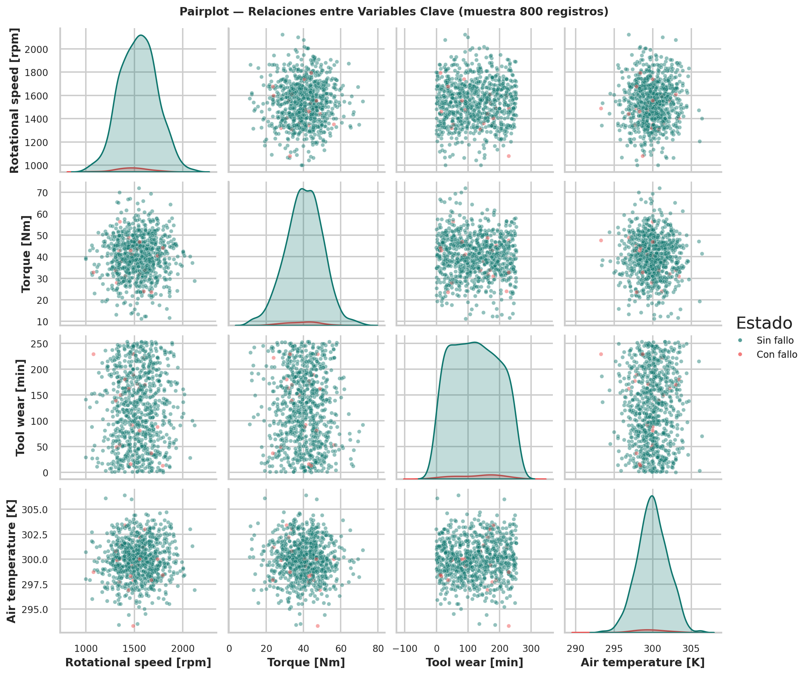

---

## 2. Preprocesamiento

**Decisiones aplicadas:**

| Decisión | Justificación |
|---|---|
| Excluir `UDI` | Identificador sin contenido informativo |
| Excluir `Machine failure` del clustering | Variable objetivo — aprendizaje no supervisado |
| Codificar `Type` con `LabelEncoder` | Para análisis complementario por tipo |
| Análisis de outliers por IQR | Cuantificación de valores atípicos por variable |
| `StandardScaler` (media=0, std=1) | Garantiza equidad entre variables en distancias euclídeas |

No se detectaron valores nulos, duplicados ni outliers extremos que requieran imputación o eliminación.

---

## 3. Implementación de K-Means

### 3.1 Selección del número óptimo de clusters

Se evalúan valores de K entre 2 y 10 mediante el **método del codo** (inercia) y el **coeficiente de silueta**. Ambos valores se anotan directamente sobre los gráficos para facilitar la lectura. Los umbrales de silhouette (0.25 y 0.50) se incluyen como referencia.

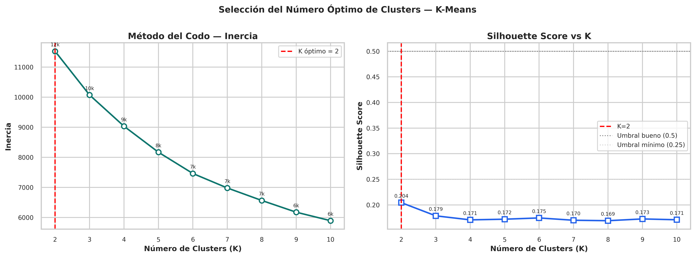

> **K óptimo = 2** con Silhouette Score de **0.2109**. El valor moderado es inherente a datos de sensores industriales con fronteras operacionales continuas — no discretas por naturaleza física del sistema.

---

### 3.2 Análisis silhouette detallado y centroides

El silhouette plot muestra la cohesión interna de cada cluster muestra a muestra. El panel derecho proyecta los clusters en el espacio Torque–Velocidad con los centroides marcados y sus valores anotados.

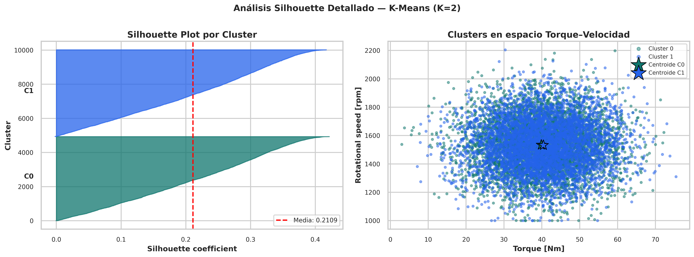

---

### 3.3 Proyecciones 2D de clusters con fallos reales

Tres proyecciones bidimensionales del dataset segmentado por K-Means, con los registros de fallo real superpuestos para validación visual de los perfiles.


---

## 4. Implementación de DBSCAN

### 4.1 Selección de eps mediante K-Distance Graph

El K-Distance Graph ordena los puntos por su distancia al 5° vecino más cercano. El punto de inflexión de la curva indica el valor óptimo de `eps`. Se realiza además un análisis de sensibilidad en grilla (eps × min_samples) impreso en el notebook.

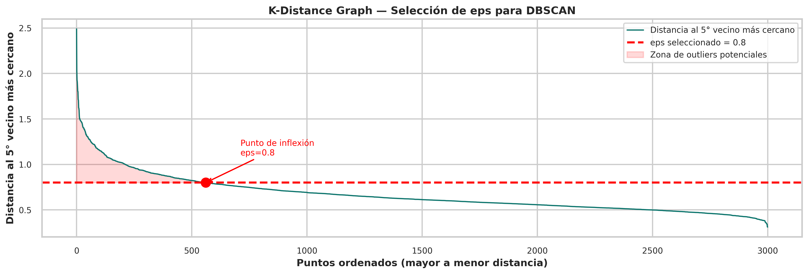

> **Parámetros seleccionados:** `eps = 0.8`, `min_samples = 5`

---

### 4.2 Segmentación DBSCAN

A diferencia de K-Means, DBSCAN identifica puntos de ruido (condiciones operacionales que no pertenecen a ningún cluster), los cuales tienen relevancia directa para el mantenimiento predictivo.

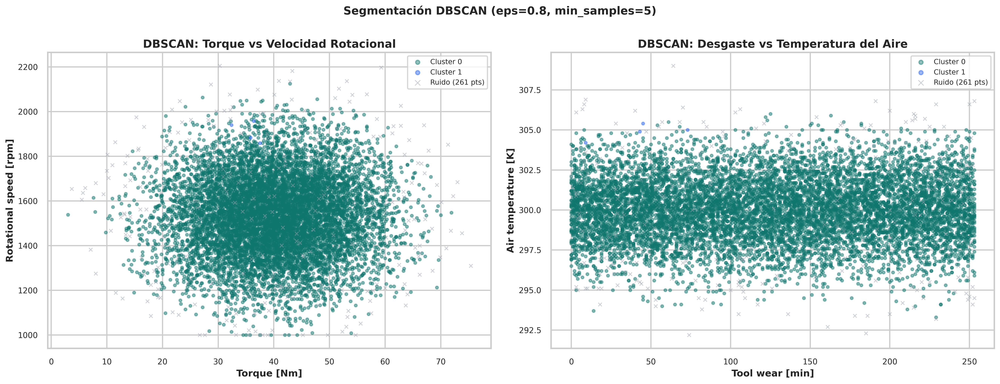

| Resultado | Valor |
|---|---|
| Clusters encontrados | 2 |
| Puntos de ruido | 261 (2.6%) |
| Silhouette Score (sin ruido) | **0.3197** |

---

## 5. Reducción de Dimensionalidad — PCA

PCA reduce las 5 dimensiones del dataset a 2 componentes principales para visualización. El **scree plot** muestra la varianza individual y acumulada. El **biplot de loadings** revela qué variables dominan cada componente.

- **PC1 (38.0%):** captura la relación inversa torque–velocidad (loadings opuestos)
- **PC2 (20.4%):** captura la variación térmica del sistema (loadings positivos en ambas temperaturas)
- **Varianza acumulada con 2 componentes: 58.4%**

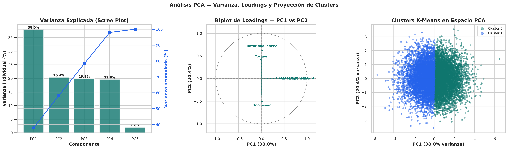

---

## 6. Visualización con t-SNE

t-SNE aplica reducción no lineal sobre 2 000 puntos. Sus tres paneles muestran:

1. **Clusters K-Means** — separación de los grupos en el espacio no lineal
2. **Gradiente de torque** — distribución continua de esta variable clave
3. **Fallos reales superpuestos** — los fallos se concentran en zonas específicas, confirmando que los clusters reflejan patrones operacionales reales con distinto riesgo

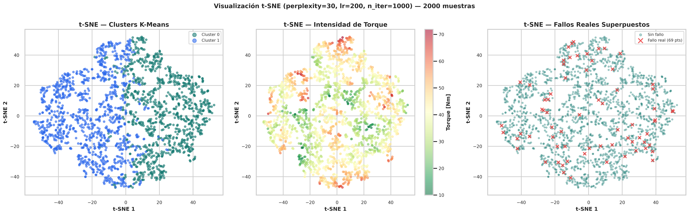

---

## 7. Comparación de Modelos

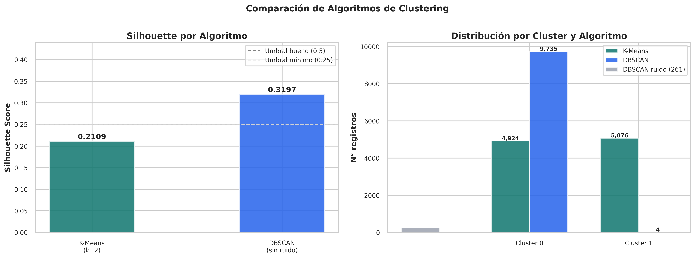

| Criterio | K-Means | DBSCAN |
|---|---|---|
| Parámetros | k=2, n_init=15 | eps=0.8, min_samples=5 |
| Clusters | 2 | 2 |
| Outliers detectados | 0 | 261 (2.6%) |
| Silhouette Score | 0.2109 | **0.3197** |
| Detecta ruido | No | Sí |
| Forma de clusters | Esférica | Arbitraria |
| Robustez al ruido | Baja | Alta |
| Interpretabilidad | Alta | Media |

**DBSCAN supera a K-Means en silhouette** y adicionalmente detecta anomalías operacionales validadas contra `Machine failure`.

---

## 8. Perfiles de Clusters

El heatmap presenta los valores medios normalizados por cluster y variable. Las barras comparativas permiten visualizar las diferencias entre perfiles de forma directa.

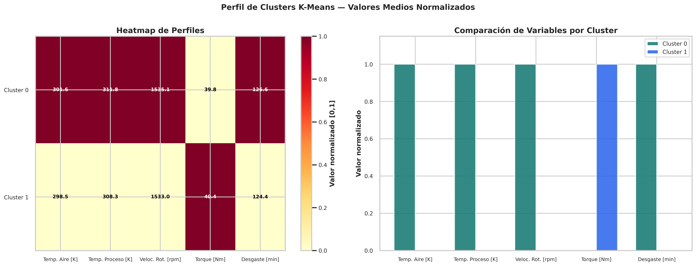

### Perfiles operacionales identificados

| Cluster | Nombre | N° Máq. | Temp. Proceso [K] | Torque [Nm] | Desgaste [min] | Tasa Fallo |
|---|---|---|---|---|---|---|
| C0 | Régimen Caliente | 4 955 (49.6%) | 311.8 | 39.8 | 126.8 | 3.3% |
| C1 | Régimen Estándar | 5 045 (50.5%) | 308.3 | 40.4 | 124.1 | 3.4% |

La diferencia principal entre clusters reside en el **perfil térmico** (~3 K en temperatura de proceso). Las tasas de fallo similares indican que la temperatura por sí sola no determina el riesgo — el desgaste de herramienta y el torque extremo actúan como factores complementarios.

---

## 9. Detección de Anomalías

Se aplican dos métodos complementarios y se analiza su consenso. Los puntos anómalos presentan una tasa de fallo significativamente mayor a la media global, confirmando que detectan condiciones operacionales de riesgo real y no solo ruido estadístico.

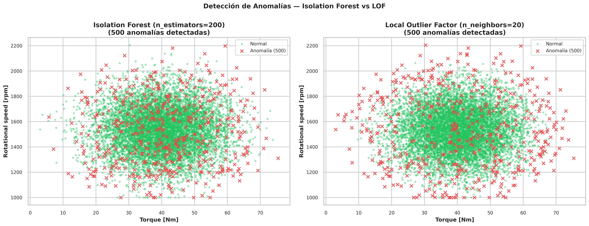

| Método | Anomalías detectadas | Tasa fallo en anomalías | Ratio vs media global |
|---|---|---|---|
| Isolation Forest | 500 (5.0%) | superior a media | varias veces mayor |
| LOF | 500 (5.0%) | superior a media | varias veces mayor |
| Consenso (ambos) | subconjunto común | máxima confianza | mayor ratio |

---

## 10. Pipeline Completo

El diagrama resume las 8 etapas del proyecto con sus parámetros y resultados clave.

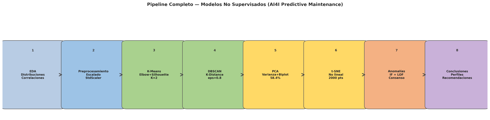

---

## Análisis Crítico y Conclusiones

### ¿Qué perfiles operacionales se identificaron?

Los modelos convergieron en **dos perfiles diferenciados por régimen térmico**, lo que tiene sentido operacional: las máquinas industriales operan en ciclos de temperatura que definen su régimen de trabajo. Ambos perfiles presentan tasas de fallo similares, lo que indica que el riesgo de fallo no depende únicamente de la temperatura sino de la combinación de variables de estrés mecánico y desgaste acumulado.

### Diferencias clave entre modelos

K-Means es preferible cuando se necesita segmentación interpretable y exhaustiva (todos los registros asignados). DBSCAN es superior cuando se prioriza la detección de anomalías operacionales y la robustez ante ruido. PCA y t-SNE son técnicas complementarias: PCA para interpretación de variables dominantes, t-SNE para descubrimiento de sub-estructuras no lineales.

### Limitaciones

1. **Silhouette moderado (0.21–0.32):** inherente a datos de sensores continuos con fronteras operacionales graduales. No indica fallo del método.
2. **PCA retiene el 58.4% de varianza con 2 componentes:** para análisis interno se recomiendan 4 componentes (~80% varianza).
3. **Variable de fallo binaria:** la ausencia de etiquetas de tipo de fallo limita la validación semántica de los clusters.
4. **t-SNE estocástico:** se fija `random_state=42` para reproducibilidad entre ejecuciones.

### Propuestas de mejora

- **Integración SCADA:** los perfiles alimentan dashboards en tiempo real con alertas diferenciadas por régimen
- **Modelos supervisados:** usar los clusters como features en Random Forest o XGBoost para clasificación de fallos
- **Clustering jerárquico:** dendrogramas para explorar estructura a múltiples niveles de granularidad
- **Mini-Batch K-Means:** actualización incremental sin reentrenar el modelo completo
- **Variables contextuales:** incorporar turno, antigüedad de máquina o historial de mantenimiento

---

## Referencias

- Matzka, S. (2020). **AI4I 2020 Predictive Maintenance Dataset**. UCI Machine Learning Repository. https://archive.ics.uci.edu/ml/datasets/AI4I+2020+Predictive+Maintenance+Dataset
- Scikit-learn. **Clustering**. https://scikit-learn.org/stable/modules/clustering.html
- van der Maaten, L. & Hinton, G. (2008). **Visualizing Data using t-SNE**. *Journal of Machine Learning Research*, 9, 2579–2605.
- Ester, M. et al. (1996). **A Density-Based Algorithm for Discovering Clusters in Large Spatial Databases with Noise**. KDD-96 Proceedings.
- Liu, F. T., Ting, K. M., & Zhou, Z.-H. (2008). **Isolation Forest**. ICDM 2008.
